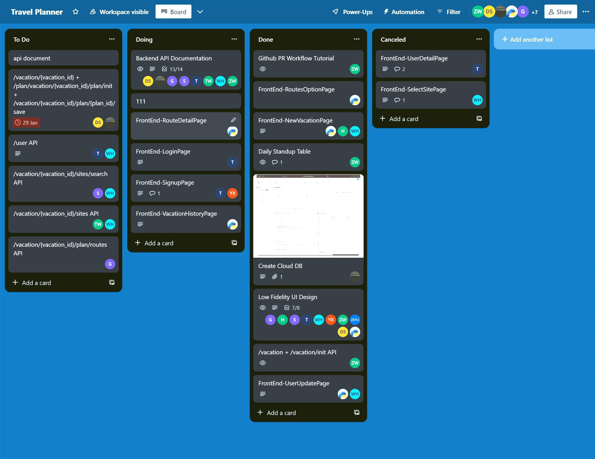

### **Introduction**

**Travel Planner** is a web application in Golang to help users automate travel plan suggestion, generation and archiving. I worked as the backend **Tech Lead** in a team of 10 people. I captured the business insight of leveraging GPT as a potentially reliable source of site recommendation and integrated it with TripAdvisor APIs to build a fully-automated site suggestion feature. [[**code**](https://github.com/Criss-Wang/twitch-plus/tree/main)][[**Slides**](https://docs.google.com/presentation/d/1OWBaqNC8_jkJSOGyLIuRiuyYzgNggsb9lkeuI2QteJw/edit?usp=sharing)]

<iframe width="560" height="315" src="https://www.youtube.com/embed/feiTAMlMq3k" frameborder="0" allow="accelerometer; autoplay; encrypted-media; gyroscope; picture-in-picture" allowfullscreen></iframe>

#### **Features**

- AI-powered Site Recommendation
- Google Map API powered route palnning
- Travel Plan generation and archiving
- Appealing UI

#### **Leading the Backend Team**

As a Tech Lead for backend, my role spans across setting up the development plan, communication and syncing, making decisions on tools and building the skeleton for the backend. To better manage the team, I also used [**Trello**](https://trello.com/) to ensure everyone is on track and bugs get fixed ASAP.

We use a sprint of 1 week during Agile development, and have team meetings every Monday and Thursday. Here\'s an example of our Kanban Board

### **Tech Stack & Methodology**

    &nbsp;
    &nbsp;
    &nbsp;
    &nbsp;
    &nbsp;
    &nbsp;
    &nbsp;

- **API lib**: TripAdvisor API, GoogleMap API
- **System Design**: N-Tier Architecture
- **Security**: JWT Authentication
- **Data**: Gorm + MySQL (on AWS RDS), Optimistic Concurrency Control
- **Algorithms**: All Pair Shortest Path (APSP) - Floyd-Warshall
- **Deployment**: Docker + Kubernetes, Horizontal Pod Autoscaling (HPA) and Istio service mesh
